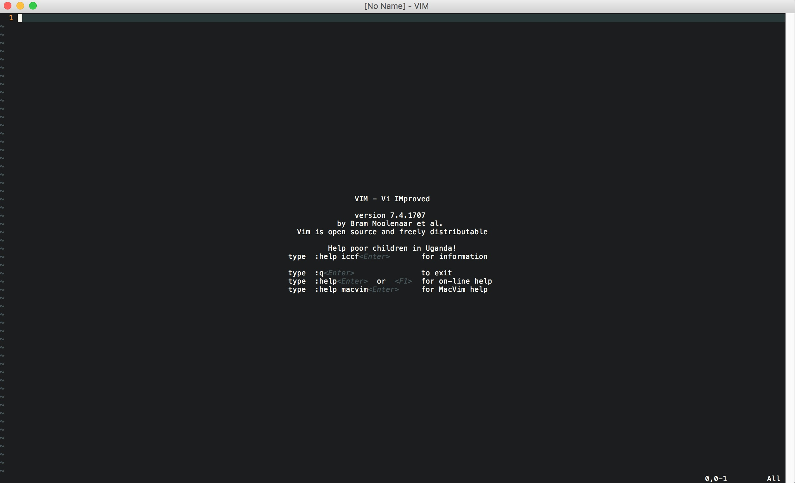
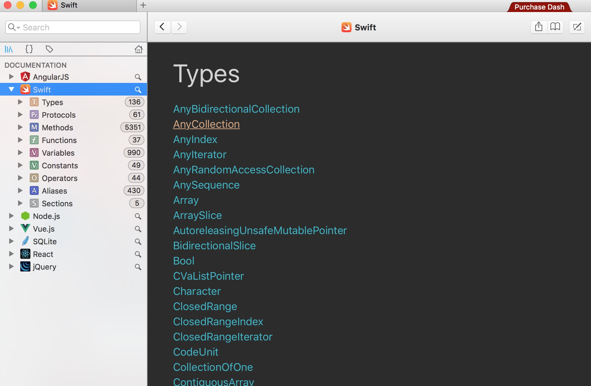
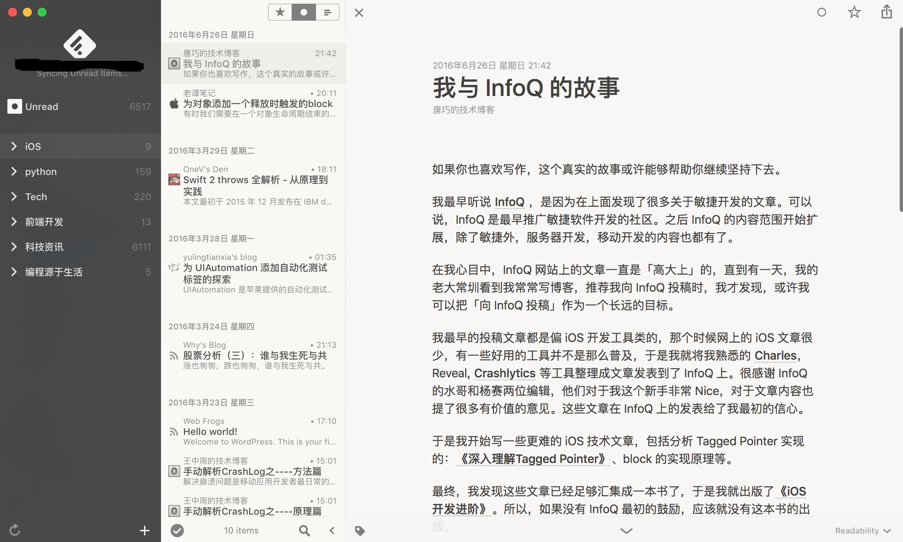
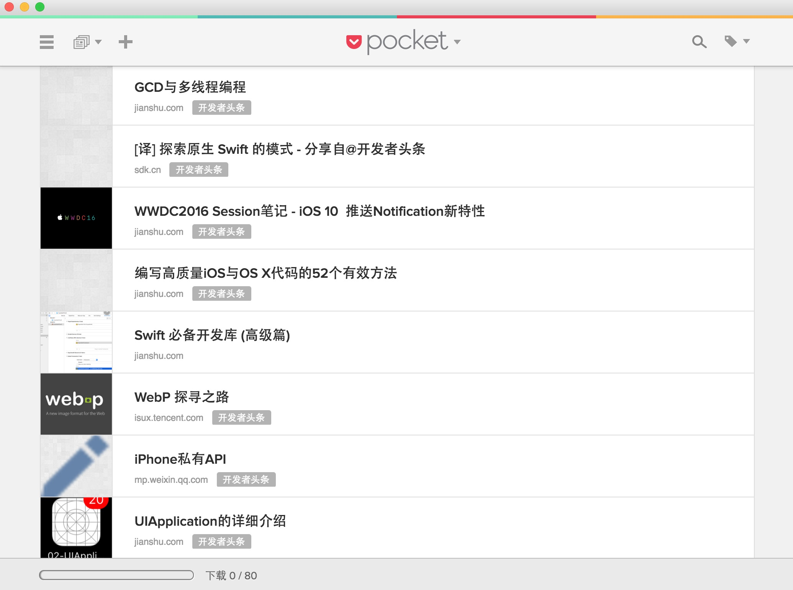
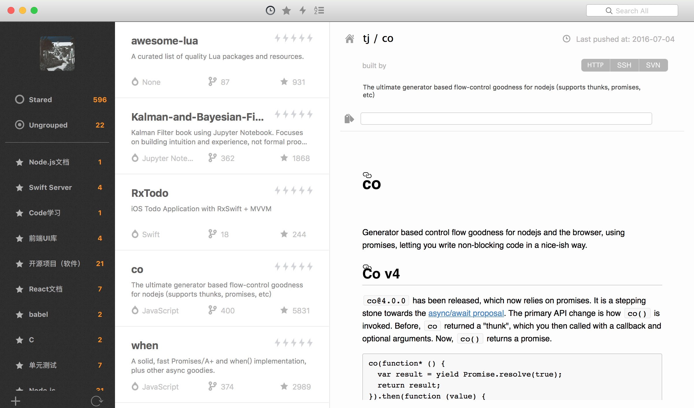
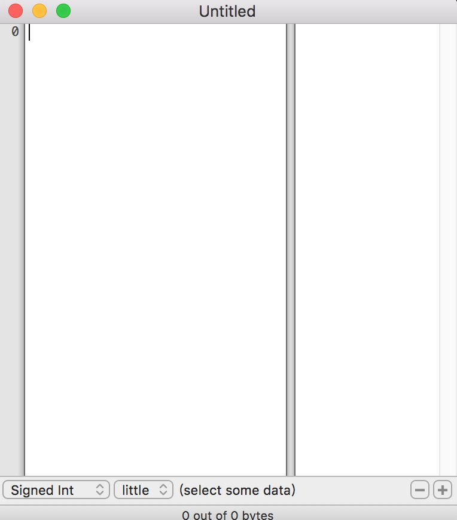
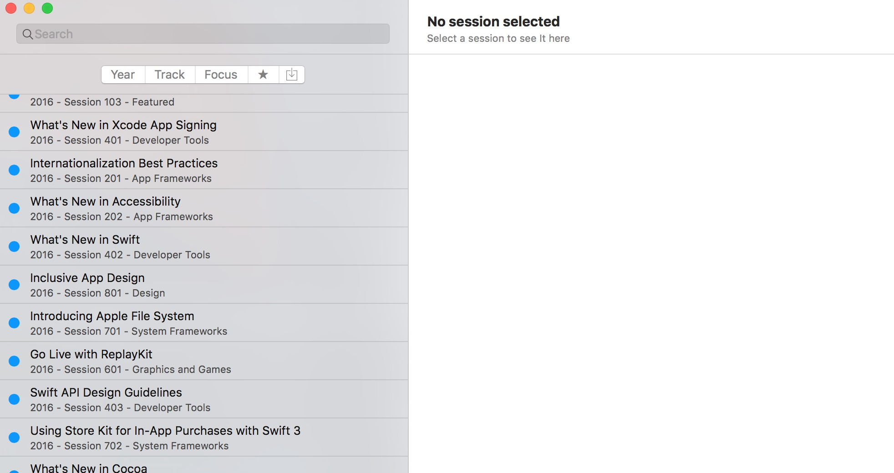
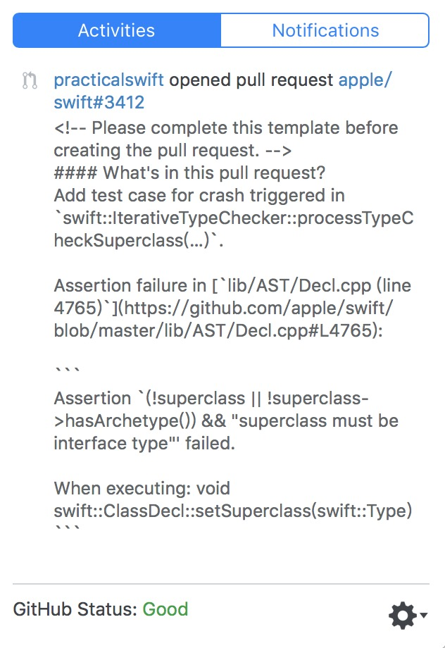
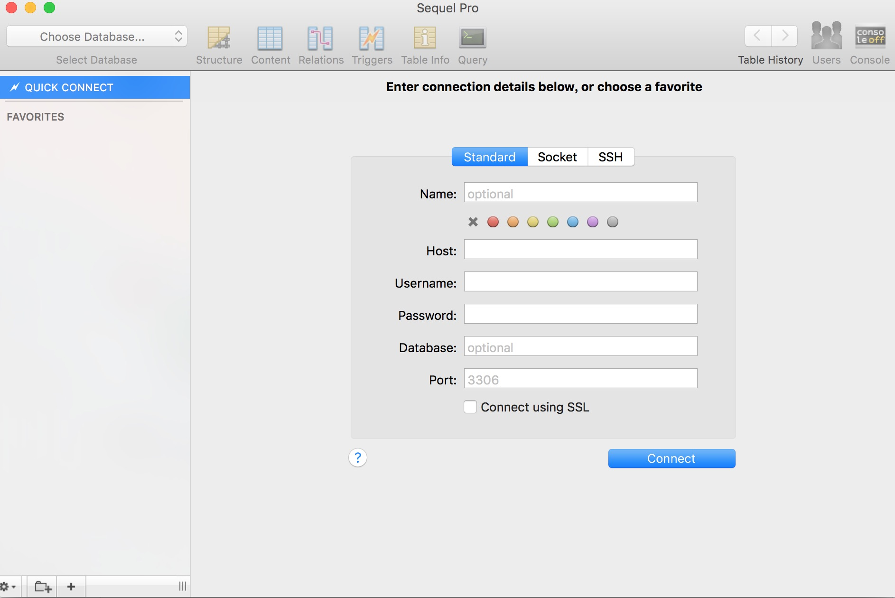
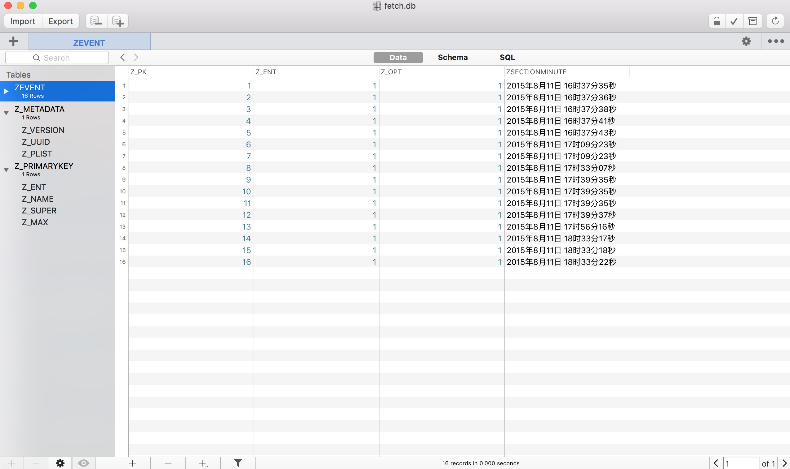

# Mac平台好用的APP

[Macvim](https://github.com/b4winckler/macvim)

> Mac 平台上唯一图形化的vim编辑器。

[Dash](https://kapeli.com/dash)

> Dash是一个API文档浏览器（ API Documentation Browser），以及代码片段管理工具（Code Snippet Manager）。

[1Password](https://agilebits.com/)

> 目前来说1Password是管理网站登录和敏感信息的最好应用。

[Reeder 3](https://itunes.apple.com/cn/app/reeder-2/id880001334?mt=12)

> 目前来说Mac上最好用的订阅阅读软件


[Pocket](https://getpocket.com)

> Pocket的主要功能就是将你要阅读或者一时没有读完的网页标记下来，接着同步到服务器端，然后你就可以在不同的设备上阅读。

[OhMyStar](http://www.ohmystarapp.com/)

> OhMyStar用于管理你的Github上star的项目。

[iHex](https://itunes.apple.com/cn/app/ihex-hex-editor/id909566003?mt=12)

> iHex是一款快速的十六进制编辑器、校验工具和文件信息查看器。

[WWDC](https://github.com/insidegui/WWDC)

> Mac上查看WWDC资源的开源APP。

[PopHub](http://questbe.at/pophub/)

> GitHub Feed Reader for OS X

[xee3](http://xee.c3.cx/)

> Xee3 Mac最佳看图工具。

[Sequel Pro](http://www.sequelpro.com/)

> 这是一款Mac平台上与phpMyAdmin类似的MySQL管理工具。

[Datum Free](https://itunes.apple.com/cn/app/sqlite-pro-le/id901631046?mt=12)

> 这是一款Mac上优秀的SQLite数据库客户端,可以方便的创建、编辑和管理SQLite数据库。

[Slack](http://www.slack.coms)

> Slack 是聊天群组 + 大规模工具集成 + 文件整合 + 统一搜索，它也提供了Mac版。

[AppCleaner](http://freemacsoft.net/appcleaner/)

> Appcleaner是一款能将应用程序和其连带着的，遍布你系统各个角落的文档一删而净的应用程序。

[网易云音乐](http://music.163.com/#f=index_productlist)

> 听歌的时候编码也是一种享受。

[Spectacle](https://github.com/eczarny/spectacle)

> Spectacle 是一个窗口管理快捷键程序,为当前窗口居中全屏上下左右半屏四分之一屏等等设定快捷键。

