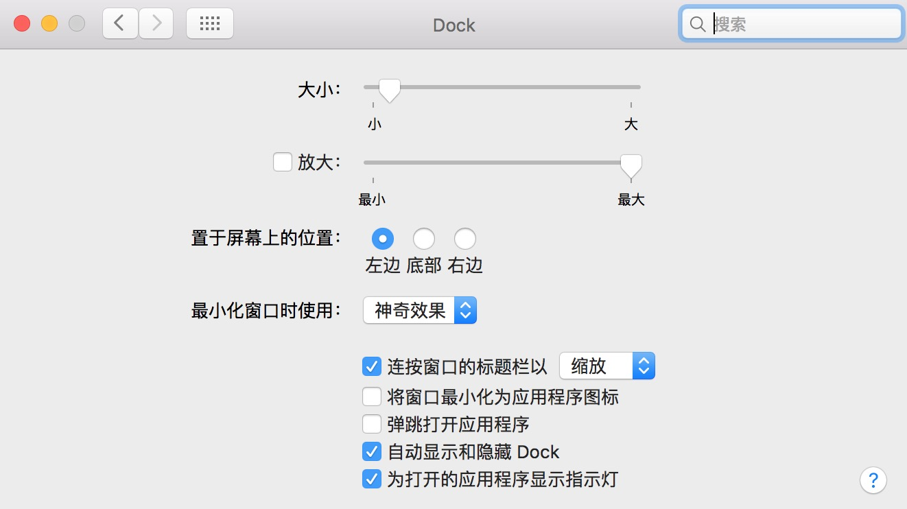
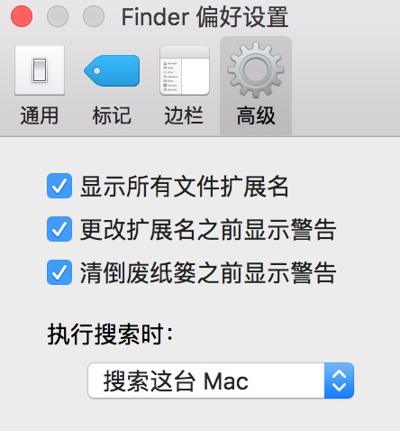

# Mac平台的开发环境配置

> 非Mac用户请自动忽略...

## Mac 调整

当你刚拿到`Mac`时（新款），你需要调整一下系统设置（System Preferences）来让你使用起来更便捷。

**触控板设置**

- 系统设置 -> 触控板
	- 光标与点击
		- 辅助点按
		- 轻点来点按
	- 滚动缩放（全勾选）
	- 更多手势
		- 应用 Expose不勾选，其他全选

**Dock设置**

- 系统设置 -> Dock
	- 置于屏幕上的位置：左
	- 为打开的应用显示指示灯
	- 自动显示和隐藏

**Finder**

- Finder -> 偏好设置
	- 通用 
		- 开启新Finder窗口时打开：Home 
	- 边栏（个人喜好选择对你有用的）
	- 高级（全部勾选）

- Finder -> 显示
	- 显示标签页栏
	- 显示预览
	- 显示路径栏
	- 显示状态栏

**菜单，Spotlight，通知中心**

菜单栏可以将`蓝牙`等不常用的图标设置隐藏，将有用的图标留下，比如`VPN`，`电池百分比`等。

`Spotlight`主要是去掉字体，书签，历史记录等不需要的内容，多设置一下自己适合的快捷键，当然你也可以通过 [Flashlight](https://github.com/nate-parrott/Flashlight) 来将增强`Spotlight`。

如果你能用好`通知中心`我想 [Today-Scripts](https://github.com/SamRothCA/Today-Scripts) 项目会是你最好的选择。
	
## 配置终端

安装`homebrew`，不装真对不起自己，访问 [homebrew](http://brew.sh/) 获取资源。

	ruby -e "$(curl -fsSL https://raw.githubusercontent.com/Homebrew/install/master/install)"

使用 [iTerm2](http://www.iterm2.com/) 来替换系统自带的终端，不可否认的是它的强大足够带来便利。

换掉/bin/bash请使用/bin/zsh，安装`oh-my-zsh`，增强你的命令行。[oh-my-zsh](https://github.com/robbyrussell/oh-my-zsh) 的配置主要集中在用户当前目录的`.zshrc`里，你可以在这里来配置你的环境变量和别名。

	sh -c "$(curl -fsSL https://raw.github.com/robbyrussell/oh-my-zsh/master/tools/install.sh)"

使用homebrew安装 `tmux` 将你的终端进行分屏，[tmux](https://tmux.github.io/) 的配置在`.tmux.conf`文件中，你可以在这里来配置快捷键等。

	brew install tmux

安装 [Vundle.vim](https://github.com/VundleVim/Vundle.vim) 来管理你的`vim`插件。

	git clone https://github.com/gmarik/Vundle.vim.git ~/.vim/bundle/vundle

你可以下载我的 [shell conf](https://github.com/icepy/icepy.vim) 来完成对终端的配置
	
	git clone https://github.com/icepy/icepy.vim.git ~/icepy.vim
	
	cp -r .vimrc ~/
	
	cp -r .vimrc.bundles ~/
	
	cp -r .tmux ~/
	
	cp -r .tmux.conf ~/
	
	cp -r .zshrc ~/
	
	或者
	
	cp -r ~/icepy.vim/* ~/

如果不想使用YouCompleteMe可以注释掉，因为此需要Apple LLVM clang编译器，在vim目录可以按F5来开启目录选择。如果你进入了vim i模式可以运行`:BundleInstall` 或者 在终端中运行 `vim+PluginInstall+qall` 来安装vim插件。在终端输入tmux，control+b （按一下）然后再按D（注意是大写），如果想关闭control+b 再按shift+7。

安装`Xcode command line tools`，运行命令后按照指引你将完成 `Xcode command line tools` 安装。

	xcode-select --install
	
`Xcode command line tools` 是Apple提供的一套集成解决方案，它将很多常用的工具都集成在了这个命令行工具中。
	

## Mac/iOS App 

如果你要写`Mac/iOS/Watch OS App`你的最佳选择应该是`Xcode`（友情提示：如果你安装了Xcode你就不需要再安装Xcode command line tools工具了）。

下列的几项工具应该是你必备的：

- [SimPholders2](http://simpholders.com/) ----- *模拟器文件目录埋的太深，用这个工具可以直接定位到模拟器目录。*
- [Makeappicon](http://makeappicon.com/) ----- *上传一张1024x1024的图片，自动生成Icon Png。*
- [Appscreens](https://appscreens.io/) ----- *提交AppStore时所需要的截图，可以使用此工具。*
- [Reveal](http://revealapp.com/) ----- *调试UI可以用的工具，在运行时动态修改，不用重新编译，非常方便。*
- [PixelWinch](http://www.ricciadams.com/projects/pixel-winch) ----- *这个工具可以测量像素。*

原始的Xcode有时候并不好用，那么下列的增强型插件总有一款你用的上：

- [Alcatraz](https://github.com/supermarin/Alcatraz) ----- *这个插件可以用来管理Xcode其他所有的插件。*
- [KSImageNamed-Xcode](https://github.com/ksuther/KSImageNamed-Xcode) ----- *使用UIImage时可以自动提示已经导入的图片。*
- [ColorSense-for-Xcode](https://github.com/omz/ColorSense-for-Xcode) ----- *使用UIColor时可以弹出Xcode的颜色选择器。*
- [SCXcodeMiniMap](https://github.com/stefanceriu/SCXcodeMiniMap) ----- *给Xcode增加一个mini小地图。*
- [VVDocumenter-Xcode](https://github.com/onevcat/VVDocumenter-Xcode) ----- *快捷的编写文档注释。*
- [XToDo](https://github.com/trawor/XToDo) ----- *快速的查看To Do列表。*
- [XAlign](https://github.com/qfish/XAlign) ----- *可以快速的使代码对其。*
- [cocoapods-xcode-plugin](https://github.com/kattrali/cocoapods-xcode-plugin) ----- *方法查看和管理pod安装的第三方库。*
- [Ciapre-Xcode-theme](https://github.com/vinhnx/Ciapre-Xcode-theme) ----- *这是我个人非常喜欢的一个主题。*

## 服务端

如果你要写`Swift`来开发服务端，你可以使用`Swift Manage Package`来安装包，如果你安装了Xcode就不需要再额外的去安装`Swift`了。

如果你要写`Node`应用还是使用`WebStorm`吧，不管是智能提示还是`Debug`还是集成都使用的非常便捷，如果你喜欢使用`vim`可以安装`WebStorm`的vim插件。

**Node环境**
	
	brew install nvm
	
安装 [nvm](https://github.com/creationix/nvm) 来管理node环境。

**mongodb环境**

	brew install mongodb

配置文件在/usr/local/etc/mongod.conf

	systemLog:
  		destination: file
  		path: /usr/local/var/log/mongodb/mongo.log
  		logAppend: true
	storage:
  		dbPath: /Users/xiangwenwen/mongodb/data
	net:
  		bindIp: 127.0.0.1

在终端运行`mongod --config /usr/local/etc/mongod.conf`，tmux session右窗口处运行mongo。

**mysql环境**

	brew install mysql

安装完成之后使用`mysql.server start`来启动`mysql`服务，这样你才能使用`mysql`数据库。

## 前端

**Sublime Text**

做为一款比较老牌的编辑器它拥有良好的灵活性（插件居多）和快捷键，前端开发好用到爆。

* [Emmet](https://github.com/sergeche/emmet-sublime)：zen coding的升级版，对于前端来说，可是必备插件;
* [sublimelint](https://github.com/lunixbochs/sublimelint)：用于代码的校验，支持 HTML、CSS、JS、PHP、Java、C++ 等16种语言;
* [JsFormat](https://packagecontrol.io/packages/JsFormat)：用于JavaScript格式化;
* [DocBlockr](https://packagecontrol.io/packages/DocBlockr)：快速编写注释;
* [SublimeCodeIntel](https://packagecontrol.io/packages/SublimeCodeIntel)：智能语法分析提示;
* [ColorPicker](https://packagecontrol.io/packages/ColorPicker)：快速选取颜色
* [HTML-CSS-JS Prettify](https://packagecontrol.io/packages/HTML-CSS-JS%20Prettify)：html/css/js 格式化
* [Alignment](https://packagecontrol.io/packages/Alignment)：用于代码对齐;
* [WakaTime](https://packagecontrol.io/packages/WakaTime)：用于记录编程时间；
* [Seti_UI](https://packagecontrol.io/packages/Seti_UI)：好看的主题，包括文件icon；
* [OmniMarkupPreviewer](https://packagecontrol.io/packages/OmniMarkupPreviewer)：将MD文件渲染成网页，可以在浏览器中查看；
* [Babel](https://packagecontrol.io/packages/Babel)：ES6语法高亮；

**Atom**

评价：后起之秀

* [TypeScript](https://github.com/TypeStrong/atom-typescript)：支持TypeScript编译；
* [run-in-browser](https://atom.io/packages/run-in-browser)：支持运行网页；
* [Emmet](https://atom.io/packages/emmet)：快速编写HTML；
* [minimap](https://atom.io/packages/minimap)：右侧小地图；
* [color-picker](https://atom.io/packages/color-picker)：CSS颜色取色器；
* [autoprefixer](https://atom.io/packages/autoprefixer)：自动补全CSS前缀；
* [autocomplete-paths](https://atom.io/packages/autocomplete-paths)：对路径选择进行增强；
* [autocomplete-python](https://atom.io/packages/autocomplete-python)：对Python提示进行增强；
* [docblockr](https://atom.io/packag* es/docblockr)：编写注释好帮手；
* [file-icons](https://atom.io/packages/file-icons)：美化编辑器图标；
* [linter-jshint](https://atom.io/packages/linter-jshint)：JavaScript语法检查；

**React Native**

Facebook基于`Atom`提供了一套开发`React Native`的插件，访问 [Nuclide](https://nuclide.io/) 来安装它吧。