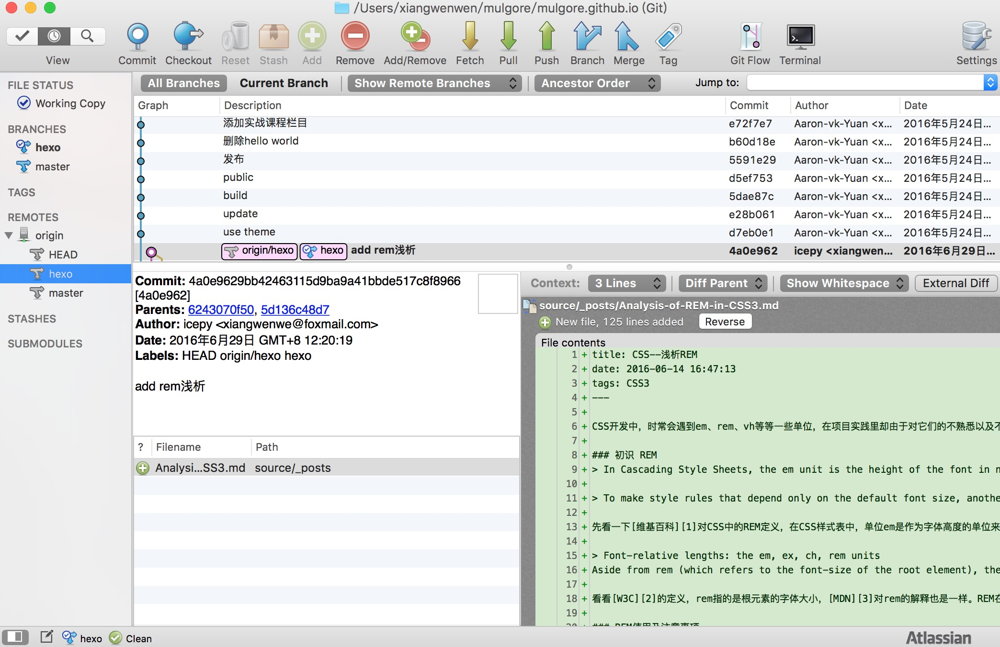

# 提高编程效率

> 虽然windows很强大，但我推荐Mac。

一个好的操作系统确实有助于我们编程，想象过编程时一气呵成的感觉吗？在我使用`Mac`来做日常生活和开发任务时，这感受真的很棒。

**编辑器或IDE**

有些时候`IDE`可以帮助我们节省很多时间，如果你是写`Mac/iOS应用`，那么`Xcode`是你最好的选择，配合 [Alcatraz](https://github.com/alcatraz/Alcatraz) 来管理增强`Xcode`的插件。

如果你是写`Node.js应用`，那么我想 [WebStorm](https://www.jetbrains.com/webstorm/) 会是你的最佳选择，不管是从构建，还是核心模块的智能提示，还是集成来看，它都是开发`Node`程序的最佳选择。

如果你是想开发`React Native`，那么你就不得不用`Atom`了。

其实编辑器和IDE的争论由来已久，无聊的时候多看看这些，如果你足够了解想来还是有好处的。在合适的情况下用合适的工具，才是最重要的。

`IDE`一般来说是针对特定语言而产生的集成环境，顾名思义它集成了你所需要的一切常用的工具。反而编辑器在灵活度上比`IDE`要有优势的多，它需要你根据自己的开发习惯而进行配置。

**Debug与测试请求**

做为开发者Debug在日常工作中所占据的比重是非常大的，好的工具和合适的方法能提高很大的效率。`Debug`可以让我们在代码中根据流程一步一步的走下去，在这中间来寻找问题所在。

前端开发者比较好用的当属Chrome Dev Tools了，这是调试前端的利器。而其他语言或者说Node.js当属在`WebStorm`中的调试器了。

对于网络请求，首推的还是属于 [Postman](http://www.getpostman.com/)，它不仅可以调试简单的HTML,CSS等网页信息，还可以发送几乎所有的网络请求。

当然DHC也是一款很不错的调试请求的工具：

**图片处理和灵感收集**

在平时我们需要去处理图片，或者收集灵感素材，有些工具非常的好用。如果你是独立作者，我想你会喜欢上我所推荐的工具。

PinCap 图片资源收集管理工具，帮助设计师和图片收藏家打理自己的本地和云端图库，让你畅游互联网的时候顺便把自己喜欢的图片收藏起来。

[Pixelmator](http://www.pixelmator.com/mac/) 是一款Mac平台独有的处理图片的软件，正因为独有相比PS它总能第一时间支持苹果最新的软件和硬件技术。

Prepo基于Mac和iOS的一款免费且方便的图标转化器,它可以帮助设计师快速的导出各种尺寸的图标。设计师通过Prepo把任何格式的图片文件转换成iOS可用的图片格式。

**终端和Alfred**

对于Mac用户（或者说Linux用户）而言，20%的命令行完成了80%的工作。虽然命令行有很多种类，但常用的确实很少，最重要的是你不需要一个一个的记忆下来，只需要有一个粗略的印象，后续在资料中查询。

`iTerm`比自带的终端要好用的多：

使用终端的优点在于我们可以摆脱鼠标的操作——这可以让我们更容易集中精力于完成任务。虽是如此，但是这也意味着学习 Linux 会越来越轻松。

当然做为一名高效的开发者，搜索的需求是非常大的，不管是本地文件的搜索，还是远程的搜索。

`Alfred`在一定程度上可以代替你的搜索需求，当然它能达到的功效不仅仅如此。在我看来这是一款非常效率的软件，摸索摸索也许你就会乐在其中。

**文档处理**

随着语言和框架的爆发式增长，文档集成的重要性就凸显而出。我们需要在一个环境中自由自在的查询API，查看使用的方法。

[Dash](http://kapeli.com/dash) 正是我们所需要的工具：

而在将来我们有了写作的需求时 `markdown` 语法是我们最好的选择，在Mac上除了`Mou`（不要问我为什么，因为作者烂尾了），最让我满意的还是 [Ulysses](http://www.ulyssesapp.com/) 它提供您所需的一切，从标记到图像和脚注，从链接到评论和代码。它仍完全保持置身事外的样子。使用此应用程序是一种非常美好、专注的体验，它将每天写作的苦差事变得很有趣。

对于印象笔记我想就不多做介绍。

**Task管理**

如果你是一个有时间管理的人，对于每天所需要办理的事项都有一定的安排，我想 [Trello](https://trello.com/) 会是你想要的。

`Trello` 不仅仅有任务管理的功能，对于开发者而言，如果你使用Github来管理你的源代码，配合上`Trello`可以有很完美的通知排期。

**Git**

如果你熟悉命令行，我所认知的最有效率的方式是使用命令行来提交，diff，Review代码。

当然你也可以使用SourceTree这样的工具：

