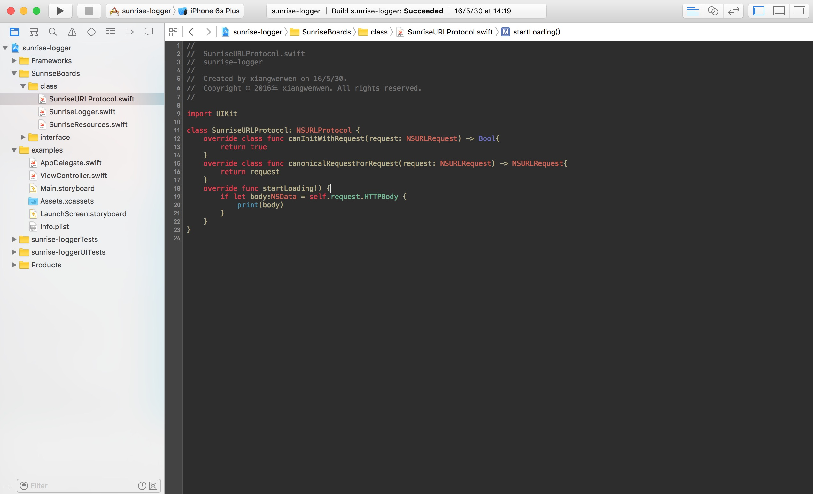

# 提高编程效率

> 虽然windows很强大，但我推荐Mac。

一个好的操作系统确实有助于我们编程，想象过编程时一气呵成的感觉吗？在我使用`Mac`来做日常生活和开发任务时，这感受真的很棒。

**编辑器或IDE**

有些时候`IDE`可以帮助我们节省很多时间，如果你是写`Mac/iOS应用`，那么`Xcode`是你最好的选择，配合 [Alcatraz](https://github.com/alcatraz/Alcatraz) 来管理增强`Xcode`的插件。

如果你是写`Node.js应用`，那么我想 [WebStorm](https://www.jetbrains.com/webstorm/) 会是你的最佳选择，不管是从构建，还是核心模块的智能提示，还是集成来看，它都是开发`Node`程序的最佳选择。

如果你是想开发`React Native`，那么你就不得不用`Atom`了。

其实编辑器和IDE的争论由来已久，无聊的时候多看看这些，如果你足够了解想来还是有好处的。在合适的情况下用合适的工具，才是最重要的。

`IDE`一般来说是针对特定语言而产生的集成环境，顾名思义它集成了你所需要的一切常用的工具。反而编辑器在灵活度上比`IDE`要有优势的多，它需要你根据自己的开发习惯而进行配置。

**图片处理和灵感收集**

在平时我们需要去处理图片，或者收集灵感素材，有些工具非常的好用。

PinCap 图片资源收集管理工具，帮助设计师和图片收藏家打理自己的本地和云端图库，让你畅游互联网的时候顺便把自己喜欢的图片收藏起来。

[Pixelmator](http://www.pixelmator.com/mac/) 是一款Mac平台独有的处理图片的软件，正因为独有相比PS它总能第一时间支持苹果最新的软件和硬件技术。

Prepo基于Mac和iOS的一款免费且方便的图标转化器,它可以帮助设计师快速的导出各种尺寸的图标。设计师通过Prepo把任何格式的图片文件转换成iOS可用的图片格式。

**终端和Alfred**

对于Mac用户（或者说Linux用户）而言，20%的命令行完成了80%的工作。虽然命令行有很多种类，但常用的确实很少，最重要的是你不需要一个一个的记忆下来，只需要有一个粗略的印象，后续在资料中查询。

`iTerm`比自带的终端要好用的多：

使用终端的优点在于我们可以摆脱鼠标的操作——这可以让我们更容易集中精力于完成任务。虽是如此，但是这也意味着学习 Linux 会越来越轻松。

当然做为一名高效的开发者，搜索的需求是非常大的，不管是本地文件的搜索，还是远程的搜索。

`Alfred`在一定程度上可以代替你的搜索需求，当然它能达到的功效不仅仅如此。在我看来这是一款非常效率的软件，摸索摸索也许你就会乐在其中。

**文档处理**

